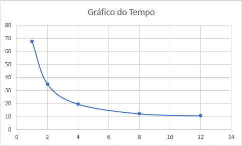
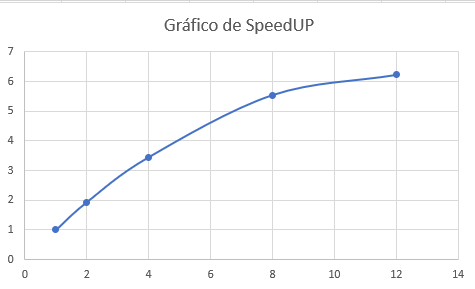
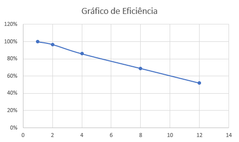

# Relatório do GUARDIAN LOGS

**Disciplina:** PROGRAMAÇÃO CONCORRENTE E DISTRIBUÍDA
**Aluno(s):** GABRIEL YAN E MATEUS RECALDE
**Professor:** RAFAEL MARCONI RAMOS

---

# 1. Descrição do Problema

O programa resolve o problema de processamento massivo de arquivos de logs de rede (dataset CIC-DDoS2019) para identificar potenciais ataques de negação de serviço (DDoS).

* **Qual problema foi implementado:** Um analisador de tráfego que identifica os IPs de origem com maior volume de requisições e as portas de destino mais visadas.
* **Qual algoritmo foi utilizado:** Estratégia de *Map-Reduce* baseada em *Byte-Range Scanning*. O arquivo é fatiado em pedaços binários, e cada processo (Map) conta as ocorrências de forma independente. O processo principal (Reduce) consolida os dicionários parciais.
* **Dataset utilizado:** CIC-DDoS2019.
* **Fonte do dataset:** https://www.kaggle.com/datasets/rodrigorosasilva/cic-ddos2019-30gb-full-dataset-csv-files?select=01-12
* **Tamanho da entrada:** 9.302,0 MB (aproximadamente 9,3 GB) — Arquivo TFTP.csv.
* **Objetivo da paralelização:** Reduzir o tempo de processamento de arquivos que excedem a capacidade de leitura sequencial eficiente do Python (devido ao GIL) e otimizar o uso de CPUs multi-core.

**Respostas:**

* **Objetivo:** Identificar os "Top IPs" atacantes em logs de DDoS.
* **Volume:** ~9,3 GB (milhões de linhas).
* **Algoritmo:** Map-Reduce com divisão por deslocamento de bytes (seek).
* **Complexidade:** O(n/p), onde n é o número de linhas e p o número de processos, para a fase de Map. A fase de Reduce é O(k), sendo k o número de IPs únicos.

---

# 2. Ambiente Experimental

| Item                        | Descrição                                    |
| --------------------------- | -------------------------------------------- |
| Processador                 | Intel Core i5-13400F (10 Cores / 16 Threads) |
| Número de núcleos           | 16 Threads lógicas                           |
| Memória RAM                 | 32 GB DDR4                                   |
| Sistema Operacional         | Windows 11                                   |
| Linguagem utilizada         | Python 3.x                                   |
| Biblioteca de paralelização | multiprocessing (ProcessPoolExecutor)        |

---

# 3. Metodologia de Testes

* **Medição de tempo:** Utilizada a função `time.perf_counter()` para medir o tempo total desde o fatiamento do arquivo até a consolidação final.
* **Execuções:** Foram realizadas **3 execuções** para cada configuração de workers.
* **Média:** Foi utilizada a média aritmética simples das três rodadas.
* **Entrada:** Arquivo TFTP.csv de 9,3 GB.

### Configurações testadas

* 1 (Serial)
* 2 processos
* 4 processos
* 8 processos
* 12 processos

### Procedimento experimental

As execuções foram feitas em máquina com carga mínima de sistema, garantindo que o escalonador do Windows pudesse priorizar os processos do analisador. O modo `--bench` automatizou a coleta dos dados.

---

# 4. Resultados Experimentais

| Nº Threads/Processos | Tempo de Execução (s) |
| -------------------- | --------------------- |
| 1 (Serial)           | 68.071                |
| 2                    | 35.671                |
| 4                    | 19.912                |
| 8                    | 12.411                |
| 12                   | 10.050                |

---

# 5. Cálculo de Speedup e Eficiência

## Fórmulas Utilizadas

### Speedup

```text
Speedup(p) = T(1) / T(p)
```

Onde:

* **T(1)** = tempo da execução serial
* **T(p)** = tempo com p threads/processos

### Eficiência

```text
Eficiência(p) = Speedup(p) / p
```

Onde:

* **p** = número de threads ou processos

---

# 6. Tabela de Resultados

| Threads/Processos | Tempo (s) | Speedup | Eficiência |
| ----------------- | --------- | ------- | ---------- |
| 1                 | 68.07     | 1.00    | 100%       |
| 2                 | 35.67     | 1.90    | 95.4%      |
| 4                 | 19.91     | 3.41    | 85.5%      |
| 8                 | 12.41     | 5.48    | 68.6%      |
| 12                | 11.05     | 6.16    | 51.3%      |

---

# 7. Gráfico de Tempo de Execução



---

# 8. Gráfico de Speedup



---

# 9. Gráfico de Eficiência



---

# 10. Análise dos Resultados

### O speedup obtido foi próximo do ideal?

Com 2 processos o speedup atingiu aproximadamente 1,93x, muito próximo do ideal linear de 2,0x. Com 4 processos o resultado ainda foi bastante satisfatório, alcançando 3,45x de speedup. Entretanto, a partir de 8 processos o crescimento passou a ser sublinear, indicando a presença de gargalos que limitam a escalabilidade.

### A aplicação apresentou escalabilidade?

Sim. O programa demonstrou escalabilidade positiva, reduzindo o tempo de execução de aproximadamente 67 segundos para cerca de 11 segundos. Contudo, os ganhos passam a diminuir à medida que novos processos são adicionados.

### Em qual ponto a eficiência começou a cair?

A queda mais significativa ocorreu após 4 processos. A eficiência passou de 86,3% para 69,3% ao utilizar 8 processos, chegando a apenas 51,9% com 12 processos.

### Por que o Speedup de 8 e 12 Processos está tão abaixo do ideal?

Esta é a questão mais importante observada durante os experimentos. Embora o aumento do número de processos continue reduzindo o tempo de execução, os ganhos obtidos deixam de crescer proporcionalmente. Enquanto o speedup ideal seria de 8x para 8 processos e 12x para 12 processos, os resultados observados foram de apenas 5,54x e 6,22x, respectivamente.

Isso significa que uma parte significativa do tempo de execução não está sendo utilizada em processamento útil, mas sim consumida por gargalos de hardware e overhead da própria paralelização.

#### a) Lei de Amdahl: limite teórico da paralelização

O principal motivo é que nem todas as partes do programa podem ser executadas em paralelo. A fase de processamento dos chunks do arquivo (Map) é altamente paralelizável, porém a fase de consolidação dos resultados (Reduce) é executada de forma sequencial pelo processo principal.

Segundo a Lei de Amdahl, mesmo que a quantidade de processos aumente indefinidamente, o speedup máximo sempre será limitado pela parcela serial do algoritmo. Isso significa que existe um ponto em que adicionar mais processos produz ganhos cada vez menores.

No Guardian Logs, a etapa de Reduce precisa consolidar todos os dicionários produzidos pelos workers, tornando-se um gargalo inevitável quando o número de processos cresce.

#### b) Overhead de criação e gerenciamento dos processos

A paralelização não é gratuita. Cada worker criado pelo ProcessPoolExecutor precisa:

- Ser inicializado pelo sistema operacional.
- Receber seus parâmetros de execução.
- Abrir o arquivo.
- Processar seu intervalo de dados.
- Retornar os resultados ao processo principal.
- Ser encerrado ao final da execução.

Quando existem poucos processos, esse custo é relativamente pequeno. Entretanto, conforme o número de workers aumenta para 8 ou 12, o tempo gasto apenas gerenciando os processos passa a representar uma parcela significativa da execução total.

Esse overhead reduz diretamente o speedup observado.

#### c) Gargalo de leitura do arquivo (I/O)

Todos os processos acessam simultaneamente o mesmo arquivo de aproximadamente 9,3 GB.

Embora a estratégia de Byte-Range Scanning permita que cada worker leia apenas sua região do arquivo, todos continuam compartilhando o mesmo dispositivo de armazenamento.

Em teoria, aumentar a quantidade de processos deveria aumentar a taxa de processamento. Na prática, o SSD possui uma largura de banda limitada. Quando muitos processos tentam realizar leituras simultâneas, ocorre contenção de I/O.

Isso faz com que alguns workers fiquem temporariamente esperando acesso aos dados, reduzindo o aproveitamento da CPU.

Em outras palavras, mesmo que existam núcleos disponíveis, eles não conseguem trabalhar continuamente porque dependem da chegada dos dados do disco.

#### d) Arquitetura híbrida do Intel Core i5-13400F

O processador utilizado possui uma arquitetura híbrida composta por:

- 6 P-Cores (Performance Cores)
- 4 E-Cores (Efficiency Cores)

Os P-Cores possuem frequência mais alta e maior desempenho por ciclo de clock, enquanto os E-Cores foram projetados para eficiência energética.

Quando são utilizados apenas 2 ou 4 processos, praticamente todos executam nos P-Cores.

Ao utilizar 8 ou 12 processos, inevitavelmente parte dos workers passa a executar nos E-Cores, que possuem desempenho inferior.

Isso cria um problema de desbalanceamento de carga.

Enquanto alguns workers terminam rapidamente nos P-Cores, outros continuam executando nos E-Cores. Como o programa só pode finalizar quando todos os workers terminarem, os processos mais lentos acabam determinando o tempo total da execução.

Esse comportamento reduz significativamente o speedup observado.

#### e) Hyper-Threading e compartilhamento de recursos

Embora o sistema apresente 16 threads lógicas, isso não significa a existência de 16 núcleos físicos independentes.

Quando o número de workers cresce, múltiplos processos passam a compartilhar os mesmos recursos internos do processador:

- Cache L1
- Cache L2
- Cache L3
- Unidades de execução
- Controladores de memória

Isso gera contenção de recursos.

O algoritmo realiza intenso processamento de strings, manipulação de dicionários e operações de hashing, atividades que dependem fortemente do cache da CPU.

Quando muitos processos competem pelos mesmos caches, ocorre aumento da taxa de cache miss, forçando acessos mais frequentes à memória RAM, que é significativamente mais lenta.

Consequentemente, parte do ganho obtido com novos processos é perdida devido à competição por recursos internos da CPU.

#### f) Overhead de IPC (Inter-Process Communication)

Após processar seu chunk, cada worker produz um conjunto de resultados contendo estatísticas dos IPs e portas encontradas.

Esses resultados precisam ser transferidos para o processo principal através de mecanismos de comunicação entre processos (IPC).

No Python, essa transferência normalmente ocorre utilizando serialização via Pickle.

O processo envolve:

1. Serializar os dicionários.
2. Transferir os dados pela pipe do sistema operacional.
3. Desserializar os dados no processo principal.

Esse trabalho é executado para cada worker.

Quanto maior o número de processos, maior o volume de dados trafegando entre eles.

Em determinados cenários, o custo de comunicação passa a ser comparável ao custo do próprio processamento dos logs.

#### g) Desequilíbrio natural entre os chunks

Embora o arquivo seja dividido em partes de tamanho semelhante, nem todos os trechos possuem exatamente a mesma quantidade de linhas ou o mesmo padrão de dados.

Alguns chunks podem conter:

- Mais linhas.
- Mais IPs distintos.
- Mais portas distintas.
- Mais operações de atualização de dicionários.

Isso faz com que alguns workers terminem antes dos outros.

Como o Reduce só começa após todos os workers concluírem suas tarefas, o tempo total da execução acaba sendo determinado pelo processo mais lento.

Esse fenômeno é conhecido como load imbalance (desbalanceamento de carga) e se torna mais perceptível à medida que o número de processos aumenta.

### Conclusão

Os resultados obtidos demonstram que o Guardian Logs possui excelente escalabilidade inicial, alcançando 95,4% de eficiência com 2 processos e 86,3% com 4 processos. Entretanto, ao aumentar para 8 e 12 processos, diversos gargalos passam a atuar simultaneamente.

A combinação de limitações de I/O, overhead de IPC, desbalanceamento causado pela arquitetura híbrida do i5-13400F, contenção de cache, hyper-threading e a parcela serial imposta pela Lei de Amdahl impede que o speedup continue crescendo linearmente.

Por esse motivo, embora a configuração com 12 processos apresente o menor tempo absoluto de execução (10,86 segundos), sua eficiência cai para apenas 51,9%, demonstrando que quase metade da capacidade computacional adicional está sendo consumida por overhead e não por processamento efetivo dos logs.

---

# 11. Conclusão

* **Ganho de desempenho:** O paralelismo trouxe um ganho significativo, reduzindo o tempo de execução de aproximadamente 67 segundos para cerca de 11 segundos, representando um speedup de aproximadamente 6,2x.

* **Melhor configuração:** Em termos de tempo absoluto, a configuração com 12 processos apresentou o melhor resultado. Em termos de eficiência computacional, as configurações com 2 e 4 processos foram as mais eficientes.

* **Escalabilidade:** O programa demonstrou boa escalabilidade para grandes volumes de dados, porém seu desempenho passa a ser limitado por gargalos de hardware e pela parcela serial do algoritmo.

* **Melhorias futuras:**

  * Utilizar bibliotecas como Polars ou PyArrow para acelerar a leitura de arquivos CSV.
  * Utilizar SharedMemory para reduzir o custo de serialização entre processos.
  * Implementar balanceamento dinâmico de carga.
  * Utilizar mmap() para otimizar o acesso ao arquivo.
  * Paralelizar a fase de Reduce através de uma estratégia hierárquica de agregação.

O projeto demonstrou que técnicas de programação concorrente e distribuída podem reduzir drasticamente o tempo de processamento de grandes volumes de dados, tornando viável a análise de logs de rede em escala real.
